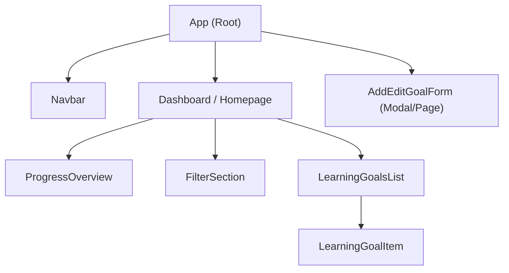

# Frontend Architecture & Usage Documentation

## Overview

This document describes the architecture, UI/UX structure, main components, styling, and usage instructions for the **Personal Learning Tracker** frontend, implemented with React. The frontend provides users with an interface to add, view, manage, and organize their learning goals through a modern, minimalistic, and responsive web application.

---

## Architecture

The frontend is a single-page React application, built using a functional/reactive paradigm. It consists of a dashboard homepage, filterable views, a grid/list overview, forms for adding/editing learning goals, and theming for both light and dark modes.

- **Component-based:** The UI is structured as a set of reusable React components.
- **No external UI library:** Styling is accomplished via CSS and CSS variables, for maximum customizability and simplicity.
- **Modern build setup:** Managed with `react-scripts`, using Create React App conventions.
- **Responsive design:** Layout and style adapt for mobile and desktop via flexible grid and CSS variables.

---

## Main UI Components

The app is composed of the following main interface elements:

- **Navigation Bar:** Persistent header for application branding and (optionally) theme toggling.
- **Dashboard/Homepage:** Central location to view progress (e.g., a summary or progress bar).
- **Filter Section:** Tools for filtering the list of goals by status (Not Started, In Progress, Completed) or category (Programming, Design, etc.).
- **Progress Overview:** Visualization (e.g., indicators, percent complete, badges) of overall learning progress.
- **Learning Goals Grid/List:** Main display area for learning goals, showing each with topic, status, target date, and notes.
- **Add/Edit Form:** Modal dialog or dedicated page for entering or editing learning goal details.
- **Footer / Help:** (Optional) Simple footer or help link.

---

## Component Hierarchy Diagram



**Notes:**
- The `App` component sets up top-level theme and layout.
- `Dashboard` hosts progress, filters, and the main goals list.
- `LearningGoalItem` is a card/row for each goal, possibly with "Edit"/"Delete" actions.
- `AddEditGoalForm` appears as a modal or page, triggered from the dashboard/list.

---

## Styling & Color Scheme

The app uses CSS variables for theme management, supporting light/dark mode and brand accents.

- **Primary:** #1976d2 (blue)
- **Secondary:** #388e3c (green)
- **Accent:** #e53935 (red)
- Other core variables and dark/light toggling are defined in `src/App.css`.

### Example (`src/App.css`):

```css
:root {
  --bg-primary: #ffffff;
  --bg-secondary: #f8f9fa;
  --text-primary: #282c34;
  --text-secondary: #61dafb;
  --border-color: #e9ecef;
  --button-bg: #1976d2;
  --button-text: #ffffff;
}
/* ...dark theme, see file for details */
```

**Theme switching** is managed by a toggle button that updates the top-level CSS `[data-theme]` attribute.

---

## Features

- **Add, edit, and view learning goals:** Full CRUD for goals and topics.
- **Progress dashboard:** Visualizes completion and status summary.
- **Filter bar:** Lets users view specific goals by their current status or category.
- **Responsive grid/list:** Adapts to different screen sizes for accessibility/performance.
- **Modern minimalistic UI:** Clean, clutter-free user experience with straightforward interactions.

---

## File Structure (Partial)

```
frontend_react_app/
│
├── package.json        # React app dependencies and scripts
├── src/
│   ├── App.js          # Root component, theme logic, and layout
│   ├── App.css         # Theme styles and color variables
│   ├── index.js        # Entry point for rendering React
│   ├── index.css       # Baseline global styles
│   └── ...             # (Other components to be implemented)
├── README.md           # Template/readme (to be updated for product docs)
└── ...                 # (Config/testing files)
```

---

## Setup & Running Locally

### 1. Prerequisites

- **Node.js** (v14+ recommended)
- **npm** (package manager)

### 2. Installation

```bash
cd learntrack-115007-091773b0/frontend_react_app
npm install
```

### 3. Running the app (development mode)

```bash
npm start
```
Access the app at [http://localhost:3000](http://localhost:3000)

### 4. Run tests

```bash
npm test
```

### 5. Build for production

```bash
npm run build
```

---

## UI/UX Guidelines

- **Navigation**: Single navigation bar, always visible at top.
- **Dashboard Layout**: Progress indicators at top, filter bar below, followed by grid/list.
- **Minimalist**: No unnecessary elements, concise forms, clear CTAs.
- **Accessibility**: Sufficient color contrast, large clickable areas, supports keyboard navigation.
- **Theme Switch**: Toggle button in header for light/dark, remembers user preference.

---

## Example User Flow

1. User opens dashboard, sees overall progress and list of current goals.
2. User clicks "Add Goal", fills out modal with topic, status, date, etc.
3. User filters to view only "Programming" or "Completed" goals.
4. User edits a goal by clicking "Edit" on its row/card.
5. User toggles theme as desired for comfort.

---

## Extending & Customizing

Developers can extend the app by:

- Adding more detailed forms (e.g., tags, priorities)
- Integrating with an API (current version is static/demonstration only)
- Adding charts/visualizations to the dashboard
- Replacing List/Grid layouts with custom components

See `src/` for main entry points; all functional UI code begins in `App.js`.

---

## References

- [React Documentation](https://reactjs.org/)
- [Create React App](https://create-react-app.dev/)

---

## Contact & Contributions

For bug reports, suggestions, or contributions, fork the repository or raise an issue in the main project tracker.

---
